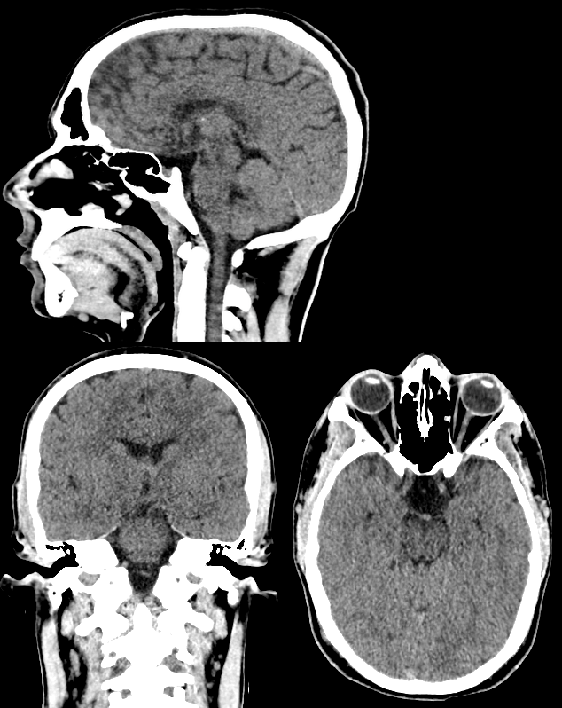
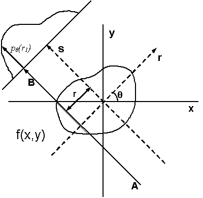
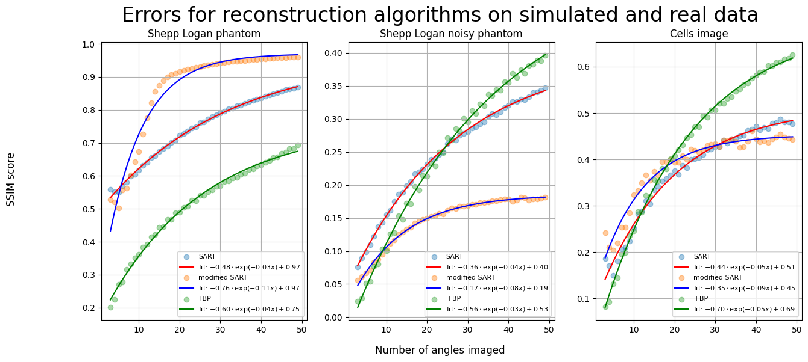
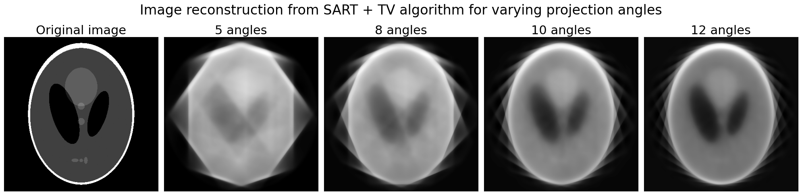
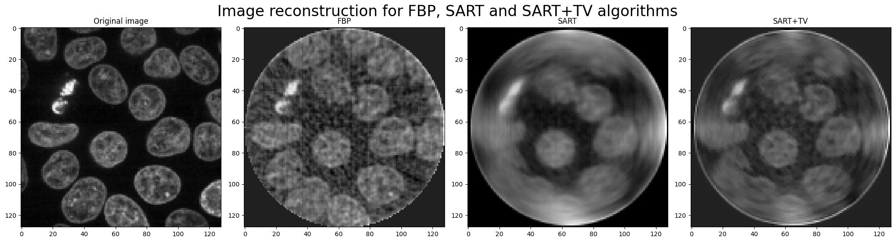

# Tomography

<p align='center'>
  
  
  
  <em>Original 3D cell volume, reconstructed volume from 50 projections, reconstructed volume from 25 projections from left to right. More details in <a href='https://github.com/msmith693/tomography#results'>results</a>.</em>
</p>

## Background
This is a project I have been working on to investigate the field of Computer Tomography, specifically Sparse View Tomography (SVT), which is an ongoing problem in many fields of research including radiology, archaeology and materials science. This repo contains information I have gathered on the field, such as the use of CT, algorithms used to solve the problems created by SVT and my own analysis and development of these algorithms.

## What is Computer Tomography?
Computer tomography is an image reconstruction technique, whereby 2D images are reconstructed from intensity projections from many different scans of the source object. It can be used to reconstruct complete 2D images of an object where the inside of the object is not accessible. 

It is extensively used in medical imaging, where it is often necessary to see 'inside' a patient's body. CT scanners use X-rays to penetrate the body of the patient, and use the intensity patterns gathered from multiple scan angles to reconstruct a slice of the patient's body.

<table>
<tr>
<td align="center" width="44%">

<figure>
    
    <figcaption>
        CT Scan of a normal human brain
    </figcaption>
</figure>

</td>

<td align="center" width="55%">

<figure>
    
    <figcaption>
        Each intensity projection of the object is made up of a set of line integrals
        through a plane parallel to the scanning plane (labelled s) in the image.
        Image from
        <a href="https://en.wikipedia.org/wiki/Tomographic_reconstruction">
            Wikipedia
        </a>.
    </figcaption>
</figure>

</td>
</tr>
</table>

The intensity angles for each projection are calculated and combined to form a sinogram. Mulitple algorithms exist to reconstruct the 2D image from the sinogram. They fall into two main categories.

### Filtered Back Projection (FBP)

### Iterative reconstruction algorithms (IR)


# Investigation of Sparse View Tomography (SVT)
In many scenarios, the number of projection angles that can be measured is limited by the constraints of the imaging device, or the need for instantaneous imaging for fast moving objects. Much of the desired image information is lost in the sinogram that is produced. 

This is an ongoing research problem and there are multiple approaches being explored to improve the quality of the reconstructed images. Noise and ghostly artefacts are often produced here, which can severely affect the performance of back projection algorithms. Iterative reconstruction methods tend to perform better as they are more resistant to noise.

## SART + TV algorithm
This is a refinment of the SART algorithm, adding a Total Variation Denoising filter at each step of the iterative process. This has proved to be much more effective than the SART algorithm for sparse angle tomography and has perfomance noted in multiple papers such as <a href="#ref1">[1]</a> <a href="#ref2">[2]</a>.


# My investigation

Using the Scikit Image python library, I investigated the effects of sparse angle tomographic reconstruction using 3 different reconstruction algorithms. Two were provided by the library, iradon() and iradon_sart(), and a third was constructed from combining iradon_sart() with the denoise_tv_chambolle() function.

By reproducing images of the Shepp-Logan phantom and a clean torus shape the basic effects of the algorithms were analysed. 

Noise was added to the phantoms to simulate a more challenging and realistic reconstruction environment. This was in the form of salt and pepper noise, and random noise with a normal distribution.

The number of projection angles was limited, and the resulting performance of the algorithms analysed. The pipeline for the experiment is as follows:

```
Add noise to phantom -> create sparse sinogram -> apply reconstruction algorithm -> clean image using filters and exposure adjustment
```

For the real cell data, the process was the same, without additional noise added. The volume was produced by combining 60 reconstructed, post-processed slices of image data. 

This was modelled as closely to a real tomographic pipeline as possible, where limitations in projection angles can arise from physical experimental setup, sensitivity of the tissue to scanning, or the need for simultaneous imaging of a fast moving object.

## Results
<p align='center'>
    
</p>
<p align='center'>

  
  <em>Original 3D cell volume on top, reconstructed volume from 50 projections bottom left, reconstructed volume from 25 projections bottom right.</em>

  <li>There is a definite loss in quality, but the overall result shows the effectiveness of a modified SART iterative algorithm combined with a Total Variation (TV) denoising filter.</li>

  <li>The images were further filtered by modifying the gamma and max and min contrast values.</li>

  <li>The artefacts on the corners of the reonstructed image are discussed further in the section on <a href="https://github.com/msmith693/tomography#image-artefacts">image artefacts</a>.</li>
</p>

<p float="left">
  
  <em>Modified TV+SART algorithm produces mixed results depending on the image that was reconstructed. While having a higher SSIM score for both the unmodified Shepp-Logan phantom and cell data, the algorithm performs worse than the unmodified iradon_sart() function on noisy Shepp-Logan phantom data.</em>

  <li>FBP outperforms both iterative algorithms as projection number increases for the noisier data. It is very poor for extremely limited angle reconstruction.</li>
</p>


## Image artefacts

<p float="center">
  
  
  <em>Visualisation of modified SART with additional TV denoising on Shepp-Logan phantom for varying projection angles. Artefacts from individual projection angles are clearly seen.</em>
</p>


When reconstructing square images, the reconstruction algorithms produce circular images. Reconstruction of the Shepp-Logan phantom does not produce this effect as it is naturally circular. This is a consequence of combination of projection angles to form an image, but resulted in lost image information and blurring around the edges of the circle, as seen below:

<p float="center">
  
  
  <li>This was counteracted by padding the original image with the mean intensity value, so as to minimise interference with the reconstruction algorithms. The reconstruced image was then cropped back into a square that captured the entire original image size. </li>

  <li>The bright fringes seen in the corner of the reconstructed volumes are a result of the crop not removing the padding perfectly. This was a balance of retaining as much original information as possible and removing the padded data. They can be ignored, as they were not part of the original image.</li>
</p>


# Next Steps

## Deep learning
From my research on this field, deep learning networks are being applied in various stages of the reconstruction process, with promising results. According to this paper <a href="#ref3">[3]</a>, deep learning has been used in end-to-end reconstruction, directly reconstructing the object volume from projection data. It has also been used in post-processing, where intermediate reconstructions are denoised and filtered. Another use is in general enhancing the use of traditional reconstruction techniques such as FBP or IR.


A secondary goal for this project was to develop a simple neural network that could be used to enhance traditional reconstructive algorithms. This would be trained on extensive data stored in open source libraries such as the [cell image library](http://www.cellimagelibrary.org/) and the sinograms produces by SVT on this data. The network would then be able to clean up sparse sinograms and aid in the reconstructive process. 

## Refererences
<p id="ref1">
  [1] V. P. Gopi and P. Palanisamy,
  "<em>CT Image Reconstruction Based on Combination of Iterative Reconstruction Technique and Total Variation</em>,"
  in <em>2013 International Conference on Signal Processing, Image Processing & Pattern Recognition</em>,
  Coimbatore, India, 2013, pp. 49–52.
  DOI:
  <a href="https://doi.org/10.1109/ICSIPR.2013.6497957">
    10.1109/ICSIPR.2013.6497957
  </a>
</p>
<p id="ref2">
  [2] Gu Y, Liu Y, Liu W, Yan R, Liu Y, Gui Z.,
  "<em>Sparse angle CT reconstruction based on group sparse representation.</em>,"
  doi: 10.3233/XST-221199, 2026.
  <a href="https://pubmed.ncbi.nlm.nih.gov/35938282/">https://pubmed.ncbi.nlm.nih.gov/35938282/</a>
</p>
<p id="ref3">
  [3] Zhantao Deng, Mériem Er-Rafik, Anna Sushko, Cécile Hébert, and Pascal Fua,
  "<em>Limited-Angle Tomography Reconstruction via Projector Guided 3D Diffusion</em>,"
  arXiv:2510.06516, 2026.
  <a href="https://arxiv.org/abs/2510.06516">https://arxiv.org/abs/2510.06516</a>
</p>
